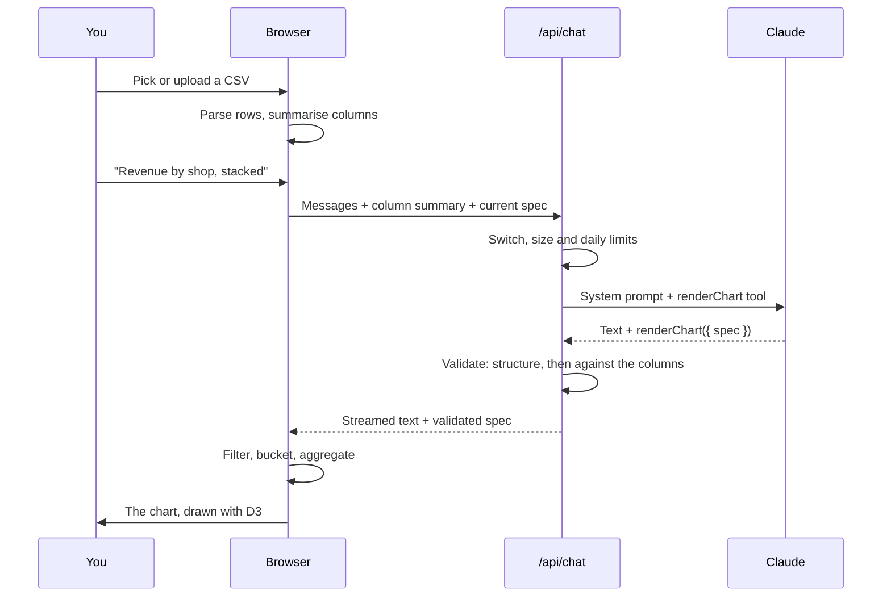

# Chartseer

Chartseer turns a CSV and a plain-English request into a chart: the AI fills in a validated chart spec and never writes code.

**Try it:** [chartseer.vercel.app](https://chartseer.vercel.app)

<!-- docs/demo.gif is still to be recorded. -->


## How it works

You pick a demo dataset or upload a CSV of your own. It is parsed and profiled in your browser and never leaves it: the model sees only a summary of the columns (names, kinds, ranges, category values) and at most 10 sample rows.

You describe the chart you want. The model's only way to answer, apart from prose, is to call one tool, `renderChart`, whose input is a chart spec: JSON that says what to plot, not how it looks. It never writes JavaScript, D3, SQL or HTML.

Every spec is checked twice on the server: once for its structure (Zod), and once against your columns (does `revenue` exist, is `shop` a category, is "Brixtn" one of its values?). If either check fails, the errors go back to the model for one retry. Nothing half-valid is ever drawn.

A validated spec reaches the browser, where your data is filtered, bucketed and aggregated for it, then drawn by Chartseer's own D3 components. Every chart has a text description, a table view, its spec on view, and SVG and PNG downloads.

Follow-ups ("make it stacked", "only Brixton") return a whole new spec, not a patch. Each chart is a step you can undo and redo, and the model is told when you go back.



## Key design decisions

- **The model fills in a contract; it never writes code** ([D-001](docs/DECISIONS.md#d-001--2026-09-23--the-model-fills-in-a-contract-it-never-writes-code)).
- **Your data stays in the browser**; the model gets a column summary and a few sample rows ([D-005](docs/DECISIONS.md#d-005--2026-09-23--data-stays-in-the-browser)).
- **Two layers of validation, one retry** ([D-006](docs/DECISIONS.md#d-006--2026-09-23--two-layer-validation-one-retry)).
- **Refinements return a full spec, not a patch** ([D-007](docs/DECISIONS.md#d-007--2026-09-23--refinements-return-a-full-spec-not-a-patch)).
- **The model chooses meaning, not appearance**: no colours, fonts or sizes in the spec ([D-008](docs/DECISIONS.md#d-008--2026-09-23--the-model-chooses-meaning-not-appearance)).
- **React owns the DOM; D3 does the maths** ([D-009](docs/DECISIONS.md#d-009--2026-09-23--react-owns-the-dom-d3-does-the-maths)).
- **Every chart has a text description and a table view** ([D-029](docs/DECISIONS.md#d-029--2026-09-24--accessible-description-and-table-view)).
- **Prompt caching** puts the tool schema, rules and dataset in the cached prefix ([D-033](docs/DECISIONS.md#d-033--2026-09-28--prompt-cache-breakpoints)).
- **Undo and redo** step through the specs drawn so far ([D-044](docs/DECISIONS.md#d-044--2026-09-30--undo-and-redo)).
- **Claude Sonnet 5**, chosen over Haiku 4.5 by a measured comparison ([D-060](docs/DECISIONS.md#d-060--2026-10-02--sonnet-5-for-the-public-demo)).
- **Daily rate limits**, failing closed, so the demo can't run up a bill ([D-061](docs/DECISIONS.md#d-061--2026-10-02--daily-rate-limits)).

The full log, with the reasoning behind each, is in [`docs/DECISIONS.md`](docs/DECISIONS.md).

## Quality and cost

`pnpm check-prompts` sends 29 requests through the real pipeline: plain requests, refinements, undo, vague, misspelt, impossible and off-topic prompts, on both demo datasets and an uploaded-style file. Latest run, 5 October 2026, Claude Sonnet 5:

| | |
|---|---|
| Expectations met | 28 of 29 |
| Charts valid first time | 25 of 25 (no retries, no failures) |
| Response time | median 2.2 s, p90 5.0 s |
| Input tokens read from cache | 94% |
| Cost per request | about $0.006 |
| Cost of a full day at the 500-message cap | about $3 |

The one miss was "Daily journeys against median hire length": a valid chart of daily journeys that left out the hire length. Claude Haiku 4.5 also met 28 of 29 at half the cost, but asked questions on vague requests where Sonnet drew a chart ([D-060](docs/DECISIONS.md#d-060--2026-10-02--sonnet-5-for-the-public-demo)).

## Stack

- **App:** Next.js 16, React 19, TypeScript (strict), Tailwind CSS 4
- **Charts:** d3-scale and d3-shape for the maths, React for the DOM; d3-dsv for CSV parsing
- **Contract:** Zod 4, which also generates the tool's JSON Schema
- **AI:** Vercel AI SDK 7 with `@ai-sdk/anthropic`, and Claude Sonnet 5
- **Rate limits:** Upstash Redis (`@upstash/ratelimit`)
- **Tests:** Vitest, Testing Library, and axe-core for accessibility
- **Hosting:** Vercel, with Vercel Web Analytics

## Running it locally

Requires Node and [pnpm](https://pnpm.io).

```bash
pnpm install
pnpm dev        # http://localhost:3000
```

| Variable | Needed | What it does |
|---|---|---|
| `ANTHROPIC_API_KEY` | Yes, for the chat | Your Anthropic API key. |
| `CHARTSEER_CHAT_ENABLED` | Yes, for the chat | `true` switches `/api/chat` on. Anything else returns 503, so the demo can be turned off in seconds. |
| `CHARTSEER_MODEL` | No | Defaults to `claude-sonnet-5`. |
| `UPSTASH_REDIS_REST_URL`, `UPSTASH_REDIS_REST_TOKEN` | In production | The daily limits. Vercel's integration names (`KV_REST_API_URL`, `KV_REST_API_TOKEN`) work too. Without them, development counts in memory, and production keeps the chat off. |

Put them in `.env.local`. Everything except the chat works without them: the first screen, uploads, the chart gallery at `/dev/gallery`, and the tests.

### Commands

```bash
pnpm dev             # local dev server
pnpm build           # production build
pnpm start           # serve the production build
pnpm test            # vitest run
pnpm typecheck       # next typegen && tsc --noEmit
pnpm lint            # eslint
pnpm try-spec <file> # run parseSpec on a { dataset, spec } JSON file (samples in scripts/specs/)
pnpm check-prompts   # live: 29 requests through the model, report in scripts/reports/ (costs tokens)
```

### The demo data

Both datasets are in the repo, in `public/data/`, so there's nothing to download to run the app.

- **Bikes** (`bikes.csv`) is a sample of about 25,000 real Santander Cycles hires. To rebuild it, download weekly `JourneyDataExtract…csv` files from [cycling.data.tfl.gov.uk](https://cycling.data.tfl.gov.uk/) into `data-raw/`, then run `node scripts/prepare-bikes.mjs data-raw/*.csv`. The sample is seeded, so the same files give the same output.
- **Gelato** (`gelato.csv`) is generated: `node scripts/generate-gelato.mjs`.

Sources, columns, cleaning and the stories planted in the gelato data are in [`docs/DATA.md`](docs/DATA.md).

### Project layout

```
app/                  Routes and wiring; no business logic. api/chat/route.ts is the only endpoint.
lib/spec/             The contract: ChartSpec schema, semantic validation, example specs, chat limits.
lib/data/             CSV parsing, column inference, spec → chart data. Pure functions.
lib/ai/               Model, system prompt, tool, request checks, rate limits. Server-only.
components/charts/    D3 renderers, the chart frame, table and spec views, downloads.
components/chat/      Chat UI.
components/studio/    The page: dataset choice, uploads, chart area, workspace.
docs/                 Architecture, decisions log, dataset notes.
scripts/              Dataset builders, the try-spec checker and the prompt check.
```

More detail: [`docs/ARCHITECTURE.md`](docs/ARCHITECTURE.md) for the design, and [`CLAUDE.md`](CLAUDE.md) for the conventions used in this repo.

## Data attribution

**Santander Cycles data:** Powered by TfL Open Data. Contains OS data © Crown copyright and database rights 2016 and Geomni UK Map data © and database rights 2019. Used under TfL's transport data terms. Chartseer is not an official TfL product. The data is a random sample (about 1 in 30.8 hires), so counts are not TfL totals.

**Gelato data:** invented. Gelateria Nebbia is a fictional chain, and every number, including the weather, is generated.

## Licence

[MIT](LICENSE) © 2026 Ives
