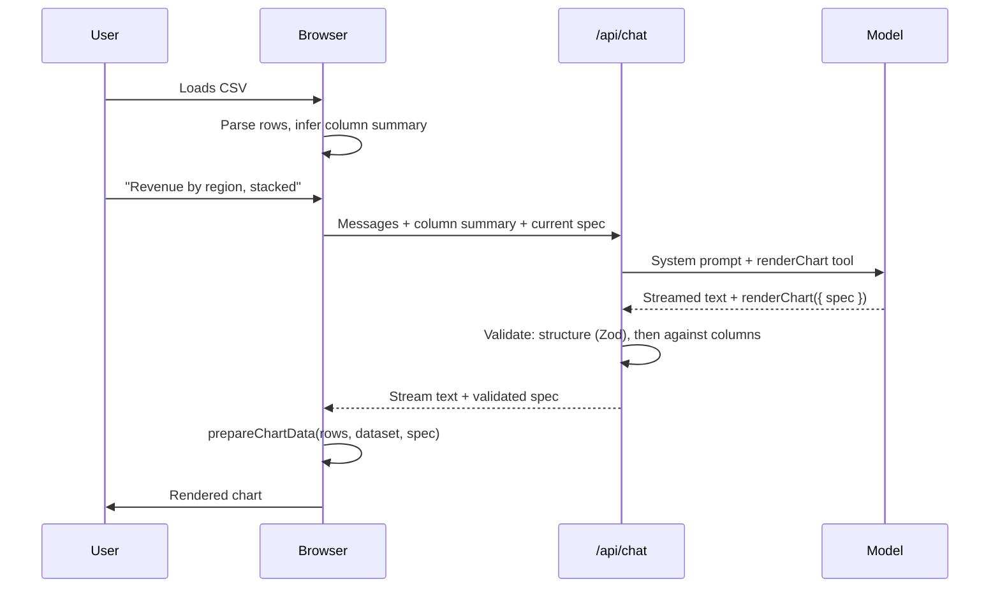

# Chartseer — Architecture

## 1. The idea in one paragraph

The user loads a CSV and talks to it: *"Revenue by region, stacked, highlight Q3."* The model does not draw anything and does not write code. It fills in a **chart spec** — a small, strictly typed JSON contract that we designed. We validate the spec, shape the data, and render it with our own D3 components. The model decides *what the chart should say*; the application decides *how it is drawn*.

## 2. Why this design

Three ways to get a chart out of a language model were considered:

1. **Model writes D3/JS, we execute it.** Flexible, but it means running generated code, failures are unrecoverable mid-stream, and output quality varies from call to call. Rejected.
2. **Model writes a Vega-Lite spec.** Quick to build, but the rendering belongs to someone else's library and the visual craft disappears. Rejected.
3. **Model fills in our own schema; we render.** Safe (no code execution), testable (specs are plain data), consistent (one renderer), and the schema itself becomes the design artefact. **Chosen.**

The consequence: the schema is the heart of the project. Time spent getting it right is never wasted.

## 3. Request lifecycle



If validation fails, the errors go back to the model as the tool result and it gets **one** retry. If that also fails, the model explains the problem to the user in prose. Nothing half-valid is ever rendered.

## 4. Modules and responsibilities

| Module | Owns | Must not |
|---|---|---|
| `lib/spec/` | `ChartSpec` schema, semantic validation, example specs, `describeSpec()` | import anything except zod |
| `lib/data/` | CSV parsing, column inference, `prepareChartData()` | know about AI or React |
| `lib/ai/` | `getModel()`, system prompt, `renderChart` tool definition | be imported by client code |
| `components/charts/` | Chart frame (margins, axes, legend), one renderer per chart type | fetch, parse, or validate |
| `components/chat/` | Message list, input, streaming states | shape data or touch D3 |
| `app/` | Routes and wiring | contain business logic |

Import direction is one-way: `app → components, lib/ai → lib/data → lib/spec`.

## 5. The chart spec (v1 draft — to be refined in Milestone 1)

> **Superseded:** `lib/spec/schema.ts` is now the source of truth. The sketch below is kept for history; D-014 and D-017 in `docs/DECISIONS.md` list what changed.

Design rules:

- **Discriminated union on `type`**, so options that only make sense for bars exist only on bars. Invalid combinations become unrepresentable.
- **Fields are referenced by exact column name.** Zod checks the shape; semantic validation checks the names against the actual dataset.
- **Every field has a `.describe()`**. These descriptions become the model's documentation via the generated JSON Schema, so they are written for the model to read.
- **Meaning, not appearance.** No colours, fonts or dimensions.
- **`version: 1`** as a literal, so the schema can evolve without guesswork.
- **Defaults are applied in one place** (`lib/spec`), never inside renderers.
- **The tool input wraps the union:** `{ spec: ChartSpec }`. Tool input schemas must be an object at the root, and a bare union isn't one.

Sketch:

```ts
const Field = z.string().describe('Exact column name from the dataset summary');

const Dimension = z.object({ field: Field, label: z.string().optional() });

const Measure = Dimension.extend({
  aggregate: z.enum(['sum', 'mean', 'median', 'count', 'min', 'max']).optional()
    .describe('How to combine rows that share the same x (and series) value'),
  scale: z.enum(['linear', 'log']).optional(),
});

const Filter = z.object({
  field: Field,
  op: z.enum(['eq', 'neq', 'gt', 'gte', 'lt', 'lte', 'in']),
  value: z.union([z.string(), z.number(), z.array(z.union([z.string(), z.number()]))]),
});

const Annotation = z.discriminatedUnion('kind', [
  z.object({ kind: z.literal('point'), x: z.union([z.string(), z.number()]), label: z.string() }),
  z.object({ kind: z.literal('range'), from: z.union([z.string(), z.number()]),
             to: z.union([z.string(), z.number()]), label: z.string() }),
]);

const Base = z.object({
  version: z.literal(1),
  title: z.string(),
  subtitle: z.string().optional(),
  filters: z.array(Filter).max(5).optional(),
  annotations: z.array(Annotation).max(5).optional(),
});

const Series = z.object({ field: Field }).describe('Split into one line/bar group per value');

const LineSpec    = Base.extend({ type: z.literal('line'),  x: Dimension, y: Measure, series: Series.optional() });
const AreaSpec    = Base.extend({ type: z.literal('area'),  x: Dimension, y: Measure, series: Series.optional(),
                                  stacked: z.boolean().optional() });
const BarSpec     = Base.extend({ type: z.literal('bar'),   x: Dimension, y: Measure, series: Series.optional(),
                                  layout: z.enum(['grouped', 'stacked']).optional(),
                                  orientation: z.enum(['vertical', 'horizontal']).optional(),
                                  sort: z.enum(['none', 'asc', 'desc']).optional() });
const ScatterSpec = Base.extend({ type: z.literal('scatter'), x: Dimension, y: Dimension,
                                  group: Series.optional() });

export const ChartSpec = z.discriminatedUnion('type', [LineSpec, AreaSpec, BarSpec, ScatterSpec]);
export type ChartSpec = z.infer<typeof ChartSpec>;
```

## 6. Validation — two layers

`parseSpec(input, dataset)` in `lib/spec/parse.ts` is the single entry point. It takes the bare spec; the server unwraps the tool input's `spec`. It returns `{ ok: true, spec }` or `{ ok: false, errors }`.

1. **Structural** (Zod): is this a well-formed spec? Each issue becomes `path: message`.
2. **Semantic** (`validateSpec(spec, dataset)`, only on a well-formed spec): does it make sense for *this* dataset?
   - every referenced field exists (x, y, series, group, filters);
   - measures with a field are numeric (`count` takes no field);
   - scatter axes: without `per`, each is a numeric `field` with no aggregate (one point per row). With `per`, each needs an aggregate: `count` takes no field; `sum`, `mean`, `median`, `min` and `max` take a numeric field. `per.field` must exist;
   - a log scale on a scatter axis needs the column's minimum above zero (a `count` axis is exempt);
   - bar charts show at most 50 categories unless `limit` is set;
   - series and scatter groups have at most 12 values;
   - an `eq` or `in` filter on the same column narrows its value count for the two checks above;
   - filter values match the column's kind: numbers for number columns, ISO 8601 strings for date columns, strings for category and text columns;
   - `gt`, `gte`, `lt` and `lte` only on number and date columns;
   - annotation values (`x`, `from`, `to`) match the x column's kind in the same way;
   - on a category column with a complete value list (§7), filter and annotation values must be in that list, with the nearest match suggested for a likely typo.

All errors are collected, not just the first. A check that needs a missing column is skipped, so one bad name gives one error. Messages share the `path: message` form, say what's wrong and list the valid alternatives — e.g. *`filters[0].value: "Amalfi Lemno" is not a value of "flavour". Did you mean "Amalfi Lemon"? Values: …`*.

## 7. Data handling

- CSV is parsed **in the browser** and kept in memory. No upload to a server, no storage.
- File size limit: 5 MB.
- Column inference produces a summary per column (`lib/spec/columns.ts`): `name`, `kind` (`number | date | category | text`), distinct count, null count, min/max where applicable, and up to 5 example values. A category column with 50 or fewer distinct values lists **all** of them instead, in natural order: calendar order for weekdays, months and seasons, otherwise the order of first appearance in the file (D-015).
- The model receives the summary, the row count and at most 10 sample rows — never the full dataset.
- `prepareChartData(rows, dataset, spec)` is the one pure pipeline from typed rows to chart-ready data: **filter → group and aggregate → sort → limit → shape** (D-021). Renderers never transform data themselves.

## 8. Conversation and refinement

- Every tool call returns a **complete** spec, never a patch. The current spec is sent with each request so the model can revise it.
- The browser keeps the list of specs as history, which gives undo for free.
- Text streams as it arrives. While a tool call is in progress, the chart area shows a skeleton. The chart renders only once the spec is complete and validated.

## 9. Rendering

- A shared **chart frame** handles margins, axes, legend, title and responsive sizing.
- One renderer per chart type, selected by a switch on `spec.type` with an exhaustive `never` check.
- React renders the SVG elements; D3 supplies scales, shape generators and ticks.
- Colours are CSS variables, so light and dark themes need no JavaScript.

## 10. Accessibility

- `describeSpec(spec, data)` produces a deterministic text summary of each chart (what is plotted, range, notable values) for screen readers.
- Every chart has a "view as table" toggle.
- Colour is never the only way to tell series apart; the legend and tooltips carry labels.
- Everything is reachable by keyboard.

## 11. Scope fence

**In v1:** CSV upload (≤ 5 MB) plus two bundled demo datasets; column inference; four chart types (line, area, bar, scatter); chat-based creation and refinement; streaming; undo via spec history; dark mode; accessibility as above; rate-limited public demo.

**Not in v1:** user accounts; a database; saved or shared projects; Excel files; multiple datasets or joins; collaboration; model-chosen styling; any model-generated code.

**Maybe, if time allows:** SVG/PNG export; a "view spec" toggle showing the JSON; shareable links that encode the spec in the URL (no database needed); a fifth chart type.

## 12. Testing

- **`lib/`:** Vitest unit tests for schema, validation, inference and `prepareChartData`. A test asserts that every example spec passes both validation layers.
- **Charts:** React Testing Library for structure and accessible text, not pixels. Visual checks happen on a dev-only gallery page that renders every example spec.
- **The model:** no live model calls in the test suite. A small script run by hand sends ~10 prompts against the demo data and reports how many produce valid specs first time.

## 13. Milestones

- [x] **M0 — Foundations:** scaffold, add `typecheck` and `test` scripts, deploy the empty app to Vercel, commit these docs.
- [x] **M1 — The contract:** `ChartSpec` schema, semantic validation, 4–6 hand-written example specs, tests.
- [ ] **M2 — Rendering without AI:** CSV parsing, column inference, `prepareChartData`, chart frame, four renderers, gallery page.
- [ ] **M3 — The AI loop:** `/api/chat`, `renderChart` tool, system prompt, streaming chat UI, validation retry, the prompt-check script.
- [ ] **M4 — Refinement and states:** follow-up edits, undo, CSV upload in the UI, error and empty states.
- [ ] **M5 — Polish:** dark mode, accessibility pass, motion, responsive layout.
- [ ] **M6 — Ship:** rate limiting, README, demo recording.

## 14. Open questions

- ~~Which two demo datasets?~~ Settled: TfL Santander Cycles and Gelateria Nebbia (D-016, `docs/DATA.md`).
- Large scatter plots: cap and sample the points, or switch to canvas above a threshold?
- Is one validation retry enough, or does the prompt-check script suggest two?
- **Tool schema size.** `RenderChartInput`'s JSON Schema is about 17 KB minified (snapshot in `lib/spec/__snapshots__/`), sent with every request. Check its token cost in M3 alongside prompt caching and the prompt-check script, before trimming any descriptions.
- **Attribution and sampling are the app's job.** The TfL attribution and the bike sample ratio (1 in 30.8) must be shown by the app wherever the bikes dataset appears, not left to the model's subtitles, which it may omit or get wrong.
- **Locale formats in uploads.** Column inference doesn't yet recognise UK-style dates (`24/09/2026`) or numbers with thousands separators (`1,234`); they come through as categories (D-019). Decide in M4, when uploads arrive.
