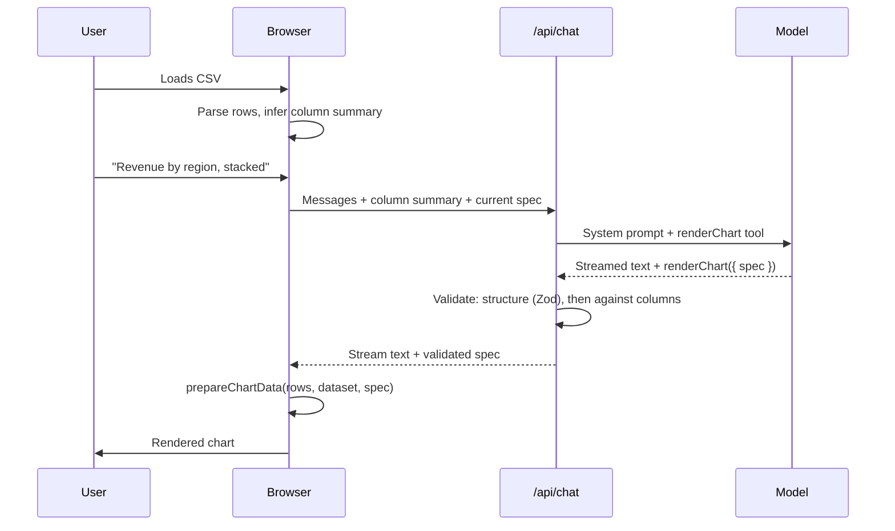

# Chartseer — Architecture

## 1. The idea in one paragraph

The user loads a CSV and talks to it: *"Revenue by region, stacked, highlight Q3."* The model does not draw anything and does not write code. It fills in a **chart spec** — a small, strictly typed JSON contract that we designed. We validate the spec, shape the data, and render it with our own D3 components. The model decides *what the chart should say*; the application decides *how it is drawn*.

## 2. Why this design

Three ways to get a chart out of a language model were considered:

1. **Model writes D3/JS, we execute it.** Flexible, but it means running generated code, failures are unrecoverable mid-stream, and output quality varies from call to call. Rejected.
2. **Model writes a Vega-Lite spec.** Quick to build, but the rendering belongs to someone else's library and the visual craft disappears. Rejected.
3. **Model fills in our own schema; we render.** Safe (no code execution), testable (specs are plain data), consistent (one renderer), and the schema itself becomes the design artefact. **Chosen.**

The consequence: the schema is the heart of the project. Time spent getting it right is never wasted.

## 3. Request lifecycle


```mermaid
sequenceDiagram
  participant U as User
  participant B as Browser
  participant S as /api/chat
  participant M as Model
  U->>B: Loads CSV
  B->>B: Parse rows, infer column summary
  U->>B: "Revenue by region, stacked"
  B->>S: Messages + column summary + current spec
  S->>M: System prompt + renderChart tool
  M-->>S: Streamed text + renderChart({ spec })
  S->>S: Validate: structure (Zod), then against columns
  S-->>B: Stream text + validated spec
  B->>B: prepareChartData(rows, dataset, spec)
  B->>U: Rendered chart
```

If validation fails, the errors go back to the model as the tool result and it gets **one** retry. If that also fails, the model explains the problem to the user in prose. Nothing half-valid is ever rendered.

## 4. Modules and responsibilities

| Module | Owns | Must not |
|---|---|---|
| `lib/spec/` | `ChartSpec` schema, semantic validation, example specs | import anything except zod |
| `lib/data/` | CSV parsing, column inference, `prepareChartData()`, `describeChart()` | know about AI or React |
| `lib/ai/` | `getModel()`, system prompt, `renderChart` tool definition | be imported by client code |
| `components/charts/` | Chart frame (margins, axes, legend), one renderer per chart type | fetch, parse, or validate |
| `components/chat/` | Message list, input, streaming states | shape data or touch D3 |
| `app/` | Routes and wiring | contain business logic |

Import direction is one-way: `app → components, lib/ai → lib/data → lib/spec`.

## 5. The chart spec (v1 draft — to be refined in Milestone 1)

> **Superseded:** `lib/spec/schema.ts` is now the source of truth. The sketch below is kept for history; D-014, D-017 and D-026 in `docs/DECISIONS.md` list what changed.

Design rules:

- **Discriminated union on `type`**, so options that only make sense for bars exist only on bars. Invalid combinations become unrepresentable.
- **Fields are referenced by exact column name.** Zod checks the shape; semantic validation checks the names against the actual dataset.
- **Every field has a `.describe()`**. These descriptions become the model's documentation via the generated JSON Schema, so they are written for the model to read.
- **Meaning, not appearance.** No colours, fonts or dimensions.
- **`version: 1`** as a literal, so the schema can evolve without guesswork.
- **Defaults are applied in one place** (`lib/spec`), never inside renderers.
- **The tool input wraps the union:** `{ spec: ChartSpec }`. Tool input schemas must be an object at the root, and a bare union isn't one.

Sketch:

```ts
const Field = z.string().describe('Exact column name from the dataset summary');

const Dimension = z.object({ field: Field, label: z.string().optional() });

const Measure = Dimension.extend({
  aggregate: z.enum(['sum', 'mean', 'median', 'count', 'min', 'max']).optional()
    .describe('How to combine rows that share the same x (and series) value'),
  scale: z.enum(['linear', 'log']).optional(),
});

const Filter = z.object({
  field: Field,
  op: z.enum(['eq', 'neq', 'gt', 'gte', 'lt', 'lte', 'in']),
  value: z.union([z.string(), z.number(), z.array(z.union([z.string(), z.number()]))]),
});

const Annotation = z.discriminatedUnion('kind', [
  z.object({ kind: z.literal('point'), x: z.union([z.string(), z.number()]), label: z.string() }),
  z.object({ kind: z.literal('range'), from: z.union([z.string(), z.number()]),
             to: z.union([z.string(), z.number()]), label: z.string() }),
]);

const Base = z.object({
  version: z.literal(1),
  title: z.string(),
  subtitle: z.string().optional(),
  filters: z.array(Filter).max(5).optional(),
  annotations: z.array(Annotation).max(5).optional(),
});

const Series = z.object({ field: Field }).describe('Split into one line/bar group per value');

const LineSpec    = Base.extend({ type: z.literal('line'),  x: Dimension, y: Measure, series: Series.optional() });
const AreaSpec    = Base.extend({ type: z.literal('area'),  x: Dimension, y: Measure, series: Series.optional(),
                                  stacked: z.boolean().optional() });
const BarSpec     = Base.extend({ type: z.literal('bar'),   x: Dimension, y: Measure, series: Series.optional(),
                                  layout: z.enum(['grouped', 'stacked']).optional(),
                                  orientation: z.enum(['vertical', 'horizontal']).optional(),
                                  sort: z.enum(['none', 'asc', 'desc']).optional() });
const ScatterSpec = Base.extend({ type: z.literal('scatter'), x: Dimension, y: Dimension,
                                  group: Series.optional() });

export const ChartSpec = z.discriminatedUnion('type', [LineSpec, AreaSpec, BarSpec, ScatterSpec]);
export type ChartSpec = z.infer<typeof ChartSpec>;
```

## 6. Validation — two layers

`parseSpec(input, dataset)` in `lib/spec/parse.ts` is the single entry point. It takes the bare spec; the server unwraps the tool input's `spec`. It returns `{ ok: true, spec }` or `{ ok: false, errors }`.

1. **Structural** (Zod): is this a well-formed spec? Each issue becomes `path: message`.
2. **Semantic** (`validateSpec(spec, dataset)`, only on a well-formed spec): does it make sense for *this* dataset?
   - every referenced field exists (x, y, series, group, filters);
   - measures with a field are numeric (`count` takes no field);
   - scatter axes: without `per`, each is a numeric `field` with no aggregate (one point per row). With `per`, each needs an aggregate: `count` takes no field; `sum`, `mean`, `median`, `min` and `max` take a numeric field. `per.field` must exist;
   - a log scale on a scatter axis needs the column's minimum above zero (a `count` axis is exempt);
   - `x.timeUnit` (line, area and bar) only on a date column;
   - bar charts show at most 50 categories unless `limit` is set. With a `timeUnit`, the count is the periods the requested dates span (below), not the distinct dates;
   - series and scatter groups have at most 12 values;
   - an `eq` or `in` filter on the same column narrows its value count for the two checks above;
   - filter values match the column's kind: numbers for number columns, ISO 8601 strings for date columns, strings for category and text columns;
   - `gt`, `gte`, `lt` and `lte` only on number and date columns;
   - annotation values (`x`, `from`, `to`) match the x column's kind in the same way;
   - on a category column with a complete value list (§7), filter and annotation values must be in that list, with the nearest match suggested for a likely typo.

All errors are collected, not just the first. A check that needs a missing column is skipped, so one bad name gives one error. Messages share the `path: message` form, say what's wrong and list the valid alternatives — e.g. *`filters[0].value: "Amalfi Lemno" is not a value of "flavour". Did you mean "Amalfi Lemon"? Values: …`*.

## 7. Data handling

- CSV is parsed **in the browser** and kept in memory. No upload to a server, no storage.
- File size limit: 5 MB.
- **Uploads** (D-041): a `.csv` of up to 5 MB, by button or drag and drop. The delimiter (comma, semicolon or tab) comes from the header line, and a byte-order mark is stripped. Bad files get a specific message: not a CSV, too large, empty, no header row, unnamed or duplicate columns, a single column, no data rows, or a row with the wrong number of values (named by row). Loading another dataset starts a new conversation, after confirming if one exists.
- **Empty charts** (D-046): a valid chart with nothing to draw shows a message in its place, not blank axes. If the filters matched no rows, it names the first filter that matched nothing, with up to three close values from the data or the column's range, and offers to send that to the model to fix. If rows matched but the plotted columns are empty there, it says which column.
- **UK and US formats** (D-042): numbers with comma thousands, a leading £, $ or € and a trailing % are read as plain numbers; the label keeps the unit. `DD/MM/YYYY` and `MM/DD/YYYY` dates become ISO. An ambiguous column is read day-first, and the user can switch it.
- Column inference produces a summary per column (`lib/spec/columns.ts`): `name`, `kind` (`number | date | category | text`), distinct count, null count, min/max where applicable, and up to 5 example values. A category column with 200 or fewer distinct values lists **all** of them instead, in natural order: calendar order for weekdays, months and seasons, otherwise the order of first appearance in the file (D-015, D-039).
- The model receives the summary, the row count and at most 10 sample rows — never the full dataset.
- `prepareChartData(rows, dataset, spec)` is the one pure pipeline from typed rows to chart-ready data: **filter → bucket → group and aggregate → sort → limit → shape** (D-021). Renderers never transform data themselves.
- **Time buckets** (D-026). With `x.timeUnit`, each date moves to the first day of its day, week, month, quarter or year before grouping. Weeks start on Monday, and everything is in UTC. Filters run first, on the raw dates. Annotation dates move to the start of their bucket too. Tick labels name the period and show the year on the first tick and wherever it changes ("30 Dec 2024", "6 Jan"; "Jan 2025", "Feb").
- **Partial buckets.** The *requested range* is the x column's min and max, narrowed by filters on that column. A bucket that reaches past it holds only some of its days, so a `sum` or `count` there looks like a dip. Such buckets are flagged in the data and drawn dashed (lines) or lighter (bars), with a footnote. Other aggregates aren't flagged. A gap inside the range, such as a closure, is real and never flagged.

## 8. Conversation and refinement

- Every tool call returns a **complete** spec, never a patch. The current spec is sent with each request so the model can revise it.
- The browser keeps the list of specs as history, which gives undo for free.
- **Undo and redo** (D-044) step through that history, with buttons in the chart area or Ctrl/Cmd+Z and Shift+Ctrl/Cmd+Z outside text fields. The chart on screen is always the current spec sent with the next request, and the user's next message starts with a short event naming it ("↩ Back to: …"), so a refinement after an undo builds on what the user sees. A new chart after an undo discards the redo steps.
- **First screen and starters** (D-045): the app opens on a choice of demo dataset or upload. Before the first chart, three or four starter prompts appear as chips that send straight into the chat: hand-picked for the demo datasets, built from the column summary for uploads.
- **Offline and errors** (D-047): offline, the chat says so and holds sending; a failed request says whether the device is offline or the server is out of reach, with Try again. A demo file that fails to load has its own Try again.
- Text streams as it arrives. While a tool call is in progress, the chart area shows a skeleton. The chart renders only once the spec is complete and validated.

## 9. Rendering

- A shared **chart frame** handles margins, axes, legend, title and responsive sizing.
- One renderer per chart type, selected by a switch on `spec.type` with an exhaustive `never` check.
- React renders the SVG elements; D3 supplies scales, shape generators and ticks.
- Colours are CSS variables, so light and dark themes need no JavaScript. Every light-mode series colour has at least 3:1 contrast; dark mode puts a subtly raised panel behind each chart (D-050). `/dev/gallery` can force either theme (D-049).
- **Tooltips** (D-052): hovering or tapping shows the values under the pointer, with labels and units. Lines and areas snap to the nearest x value.
- **Motion** (D-053): a refinement eases marks to their new places in 250 ms when they correspond, and crossfades otherwise. Nothing moves when the reader prefers reduced motion.

## 10. Accessibility

- `describeChart(spec, data)` in `lib/data/describe.ts` produces a deterministic text summary of each chart: what is plotted, the range, and where the largest value is. It is the SVG's accessible description (`aria-describedby`). It lives in `lib/data`, not `lib/spec`, because it reads the prepared `ChartData` (D-029).
- Every chart has a "View as table" toggle, which swaps the plot for an HTML table of the same `ChartData`: a caption, column and row headers, missing values read as "no data", and partial buckets marked. The title, notes and attribution stay.
- Colour is never the only way to tell series apart; the legend and tooltips carry labels. Tooltips are for pointers only and hidden from assistive technology; the table view has every value they show (D-052).
- Everything is reachable by keyboard, in the order it appears on screen. One global `:focus-visible` rule draws the focus ring in the accent colour on every control (D-056).
- All text meets WCAG AA contrast in both themes. The page has one `h1`, the wordmark; chart titles and screen titles are `h2`.
- A newly drawn chart is announced by the chat's status line, and an undo or redo by the chart area's, so each change is read out once.
- axe runs in the test suite (without colour contrast, which jsdom can't measure) and by hand in the browser on every screen, in both themes (D-057).
- Every chart has a "View spec" toggle beside "View as table": the spec as read-only JSON in a focusable, scrollable region, with a Copy button whose result is announced (D-058).
- Layout: chart and chat side by side from 768 px; below that the page scrolls, chart first, with the chat input pinned to the bottom of the screen (D-055).

## 11. Scope fence

**In v1:** CSV upload (≤ 5 MB) plus two bundled demo datasets; column inference; four chart types (line, area, bar, scatter); chat-based creation and refinement; streaming; undo via spec history; dark mode; accessibility as above; a read-only "view spec" toggle (D-058); SVG and PNG download (D-059); rate-limited public demo.

**Not in v1:** user accounts; a database; saved or shared projects; Excel files; multiple datasets or joins; collaboration; model-chosen styling; any model-generated code.

**Maybe, if time allows:** shareable links that encode the spec in the URL (no database needed); a fifth chart type.

## 12. Testing

- **`lib/`:** Vitest unit tests for schema, validation, inference and `prepareChartData`. A test asserts that every example spec passes both validation layers.
- **Charts:** React Testing Library for structure and accessible text, not pixels. Visual checks happen on a dev-only gallery page that renders every example spec.
- **The model:** no live model calls in the test suite. `pnpm check-prompts`, run by hand, sends 28 requests through `lib/ai`, including a refinement after an undo and three on an uploaded-style file, against the demo data and reports how many produce valid specs first time, with tokens and response times. Full results go to `scripts/reports/` (git-ignored). Results in D-037, D-040, D-044 and D-048.

## 13. Milestones

- [x] **M0 — Foundations:** scaffold, add `typecheck` and `test` scripts, deploy the empty app to Vercel, commit these docs.
- [x] **M1 — The contract:** `ChartSpec` schema, semantic validation, 4–6 hand-written example specs, tests.
- [x] **M2 — Rendering without AI:** CSV parsing, column inference, `prepareChartData`, chart frame, four renderers, gallery page.
- [x] **M3 — The AI loop:** `/api/chat`, `renderChart` tool, system prompt, streaming chat UI, validation retry, the prompt-check script.
- [x] **M4 — Refinement and states:** follow-up edits, undo, CSV upload in the UI, error and empty states.
- [x] **M5 — Polish:** dark mode, accessibility pass, motion, responsive layout.
- [ ] **M6 — Ship:** rate limiting, README, demo recording.

## 14. Open questions

- ~~Which two demo datasets?~~ Settled: TfL Santander Cycles and Gelateria Nebbia (D-016, `docs/DATA.md`).
- **Large scatter plots.** The 25,000-point map is no longer an example (D-051), but a user can still ask for one. Measured in M2 (D-030): the 25,132-point bikes map draws in SVG in about 0.4 s, but a resize takes about 0.5 s per width and its table view about 2 s. Kept as SVG for now. Decide whether to switch to canvas, sample, or cap the table before M5.
- ~~Is one validation retry enough?~~ Settled: yes. The prompt check found every spec valid first time, and no retry was needed in 24 cases (D-037).
- ~~**Tool schema size.**~~ Settled: the schema is 7,561 tokens, about 74% of the cached prefix. 94% of input tokens are read from cache, so it costs little per turn and is left as it is (D-038).
- ~~**Attribution and sampling are the app's job.**~~ Settled: the chart frame, both empty states and the first screen show the attribution and the bike sample ratio (1 in 30.8), never left to the model's subtitles (D-045).
- ~~**Dark mode (M5).**~~ Settled: charts follow the page theme, on a subtly raised panel in dark mode, with fainter gridlines in both (D-050). Downloads are always light-themed: `[data-chart-export]` applies the light tokens to the off-screen subtree they are drawn in, so the page never changes (D-059).
- **Gaps on time axes.** A missing day or period inside the range (Christmas Day on a daily gelato line) is joined across, not shown as a gap. Gap-filling buckets when `x.timeUnit` is set would fix it (D-051).
- ~~**Locale formats in uploads.**~~ Settled: comma thousands, £/$/€ and % are read as numbers, and slash dates are read day- or month-first per column, with a switch when a column is ambiguous. Decimal commas are not supported (D-042).
